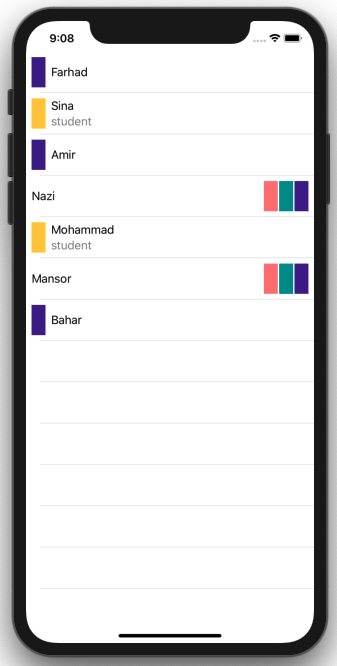

# CrazyTableView

  
  
  If you should show many cells in your tableview, maybe you have long cases in the switch and it's cause your code be croweded .
  you can use of rules for make your cells and your tableview will be clean and readable.
  
  
